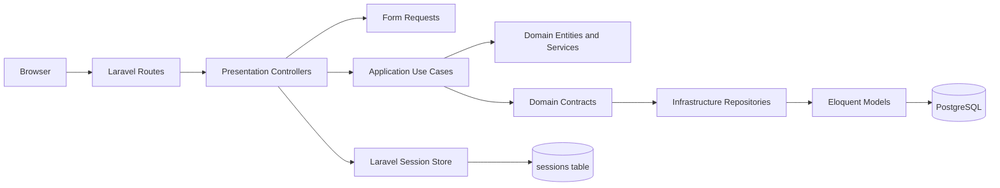

# Laravel Clean Auth Module


Module d'authentification Laravel 12 construit autour d'une Clean Architecture stricte, avec sessions securisees, PostgreSQL, hash Argon2id, validation defensive et gate de qualite CI.

## Table des matieres

- [Contexte et vision](#contexte-et-vision)
- [Fonctionnalites](#fonctionnalites)
- [Architecture](#architecture)
- [Stack technique](#stack-technique)
- [Structure du projet](#structure-du-projet)
- [Installation](#installation)
- [Configuration](#configuration)
- [Base de donnees](#base-de-donnees)
- [Tests et qualite](#tests-et-qualite)
- [Production](#production)
- [Securite](#securite)
- [Documentation](#documentation)
- [Bonnes pratiques](#bonnes-pratiques)
- [Ameliorations suggerees](#ameliorations-suggerees)
- [Licence](#licence)

## Contexte et vision

Laravel Clean Auth Module fournit une base d'authentification web robuste pour les applications Laravel qui doivent separer clairement le domaine metier, les cas d'utilisation, l'infrastructure et la presentation HTTP.

Le projet repond a un besoin precis : livrer un module d'inscription, connexion, tableau de bord protege et deconnexion qui reste testable, maintenable et deployable avec PostgreSQL en production.

### Positionnement

| Axe | Description |
| --- | --- |
| Type d'application | Web app Laravel orientee authentification serveur |
| Utilisateurs cibles | Equipes qui veulent demarrer une application Laravel avec une base auth propre et testee |
| Differenciation | Clean Architecture explicite, Domain independant de Laravel, gate CI PostgreSQL, runbooks deploiement et operations |
| Echelle visee | Base applicative production pour projets internes, SaaS ou prototypes securises |
| Business model | Aucun systeme de monetisation n'est implemente dans le code actuel |

### Roadmap produit

La base actuelle couvre le MVP auth et le durcissement production documente. Les prochaines extensions naturelles, non implementees a ce stade, sont les profils/roles, l'observabilite, l'audit trail des evenements sensibles et une politique explicite de rotation des sessions longues.

## Fonctionnalites

| Fonctionnalite | Description | Fichiers principaux |
| --- | --- | --- |
| Inscription | Creation utilisateur avec email unique, nom valide, mot de passe confirme et score minimum | `RegisterController`, `RegisterUserUseCase`, `RegisterRequest` |
| Connexion | Verification email/mot de passe, message d'erreur volontairement vague et delai sur echec | `LoginController`, `LoginUserUseCase`, `LoginRequest` |
| Session protegee | Stockage `auth.user_id`, regeneration de session et routes protegees | `RequireAuthSession`, `routes/auth.php` |
| Fingerprint session | Verification IP + User-Agent, invalidation en cas de mismatch | `SessionFingerprint`, `ValidateSessionFingerprint` |
| Deconnexion | Invalidation complete de session et regeneration CSRF | `LogoutController`, `LogoutUserUseCase` |
| Password strength | Score PHP et JavaScript synchronise sur longueur, casse, chiffre et symbole | `PasswordStrengthService`, `public/js/password-strength.js` |
| Persistance | Repository Eloquent derriere un contrat Domain | `UserRepositoryInterface`, `EloquentUserRepository`, `UserEloquentModel` |
| Operations PostgreSQL | Backup custom-format, checksum SHA-256 et restore garde par confirmation | `scripts/backup-postgres.sh`, `scripts/restore-postgres.sh` |

## Architecture

Le projet applique une Clean Architecture en quatre couches.



### Responsabilites par couche

| Couche | Responsabilite | Exemples |
| --- | --- | --- |
| Presentation | Routes, controllers, requests, middleware, vues Blade | `app/Presentation/Http`, `resources/views/auth` |
| Application | Cas d'utilisation et DTOs applicatifs | `RegisterUserUseCase`, `LoginUserUseCase`, commands/responses |
| Domain | Entites, value objects, contrats, exceptions, services metier | `User`, `Email`, `UserId`, `PasswordStrengthService` |
| Infrastructure | Adaptateurs Laravel/Eloquent et services techniques | `EloquentUserRepository`, `ArgonPasswordHasher`, providers |

## Stack technique

| Categorie | Technologies |
| --- | --- |
| Backend | PHP 8.3+, Laravel 12 |
| Architecture | Clean Architecture, ports Domain, adapters Infrastructure |
| Frontend | Blade, JavaScript vanilla, Vite 6 |
| Base de donnees | PostgreSQL 16 en production, SQLite in-memory pour tests feature |
| Sessions | Laravel database session driver |
| Securite mot de passe | Argon2id, score de robustesse cote serveur et navigateur |
| Tests | Pest PHP 3, tests unitaires et feature |
| Qualite | Laravel Pint, PHPStan niveau 8, Composer validate |
| CI | GitHub Actions avec PostgreSQL 16 et smoke test auth |
| Operations | Scripts Bash `pg_dump`, `pg_restore`, checksum SHA-256 |

## Structure du projet

```text
.
├── app/
│   ├── Application/Auth/        # Commands, responses, use cases
│   ├── Domain/Auth/             # Entites, value objects, contrats, services, exceptions
│   ├── Infrastructure/Auth/     # Eloquent, repositories, hasher, service provider
│   └── Presentation/Http/       # Controllers, requests, middleware, resources, security
├── config/                      # Configuration Laravel et auth-module
├── database/
│   ├── migrations/              # Tables users et sessions
│   └── schema.sql               # Schema PostgreSQL de reference
├── docs/                        # Deploiement et operations
├── public/js/                   # Score de force mot de passe
├── resources/views/auth/        # Vues register, login, dashboard
├── routes/                      # Routes web et auth
├── scripts/                     # Backup et restore PostgreSQL
└── tests/                       # Tests unitaires et feature
```

## Installation

### Prerequis

PHP 8.3+, Composer 2, PostgreSQL 16 recommande et Node.js compatible Vite 6 si les assets sont reconstruits. Les extensions PHP PostgreSQL doivent etre actives pour l'environnement PostgreSQL reel :

```bash
php -m | grep -E '^(pdo_pgsql|pgsql)$'
```

### Demarrage local

```bash
composer install
cp .env.example .env
php artisan key:generate
php artisan migrate
php artisan serve
```

Si les assets doivent etre reconstruits :

```bash
npm install
npm run build
```

> [!WARNING]
> Ne placez jamais de secret reel dans un fichier versionne. Les exemples ci-dessous utilisent des placeholders publics.

## Configuration

Configurer PostgreSQL dans `.env` avant la migration :

```env
DB_CONNECTION=pgsql
DB_HOST=127.0.0.1
DB_PORT=5432
DB_DATABASE=clean_auth
DB_USERNAME=clean_auth_app
DB_PASSWORD=your_database_password
```

Configuration session recommandee :

```env
SESSION_DRIVER=database
SESSION_LIFETIME=120
SESSION_ENCRYPT=true
SESSION_SECURE_COOKIE=true
SESSION_SAME_SITE=strict
```

> [!WARNING]
> `SESSION_SECURE_COOKIE=true` exige HTTPS reel au point d'entree public. En environnement local sans HTTPS, adaptez temporairement cette valeur.

### Configuration Git locale

Si une identite Git locale est necessaire, utilisez uniquement des valeurs locales :

```bash
git config --local user.name "YOUR_NAME"
git config --local user.email "your.email@example.com"
```

> [!WARNING]
> Les commandes `git config user.name` et `git config user.email` ci-dessus sont locales au depot. Remplacez les placeholders par vos informations reelles uniquement dans votre environnement local.

## Base de donnees

Les migrations creent :

| Table | Role |
| --- | --- |
| `users` | Identite utilisateur, email unique, hash de mot de passe |
| `sessions` | Sessions Laravel stockees en base |

Le schema PostgreSQL de reference est disponible dans `database/schema.sql`.

```bash
psql -U clean_auth_app -d clean_auth < database/schema.sql
```

## Tests et qualite

Commandes de validation locales :

```bash
composer validate
php artisan test
./vendor/bin/pint --test
./vendor/bin/phpstan analyse --level=8 app tests
bash -n scripts/backup-postgres.sh scripts/restore-postgres.sh
```

Les tests couvrent les value objects `Email` et `UserId`, le service de force mot de passe, les use cases login/register, les parcours feature inscription/connexion/dashboard/rate limit et le smoke test PostgreSQL en CI.

## Production

La production repose sur quatre conditions non optionnelles :

1. PostgreSQL provisionne avec un utilisateur dedie.
2. `APP_KEY`, mot de passe DB et secrets injectes hors Git.
3. HTTPS reel devant l'application.
4. Backup/restore PostgreSQL testes avant utilisateurs reels.

Guides disponibles :

- `docs/deployment.md` pour le deploiement HTTPS, secrets et migration.
- `docs/operations.md` pour la politique backup/restore.
- `scripts/backup-postgres.sh` pour creer un dump PostgreSQL avec checksum.
- `scripts/restore-postgres.sh` pour restaurer avec confirmation explicite.

Gate de release :

```bash
php -m | grep -E '^(pdo_pgsql|pgsql)$'
php artisan migrate:status
php artisan test
./vendor/bin/pint --test
./vendor/bin/phpstan analyse --level=8 app tests
```

## Securite

| Controle | Implementation |
| --- | --- |
| Hash mot de passe | Argon2id, 64 MB, 4 iterations, 1 thread |
| Session fixation | Regeneration de session apres inscription et connexion |
| Logout | Invalidation complete de session et regeneration du token CSRF |
| CSRF | Formulaires POST Laravel |
| Rate limiting | 5 tentatives/minute sur `POST /login` et `POST /register` |
| Enumeration email | Message de login vague et verification de hash meme si l'email est absent |
| Timing sur echec login | Delai de 200 ms avant retour d'erreur |
| Fingerprint session | Hash IP + User-Agent sur les routes protegees |
| Cookies | HTTP-only, Secure, SameSite strict via configuration |

## Routes

| Methode | Route | Description | Middleware |
| --- | --- | --- | --- |
| GET | `/` | Redirection vers login | Web |
| GET | `/register` | Formulaire d'inscription | `guest.session` |
| POST | `/register` | Creation de compte | `guest.session`, `throttle:5,1` |
| GET | `/login` | Formulaire de connexion | `guest.session` |
| POST | `/login` | Connexion | `guest.session`, `throttle:5,1` |
| GET | `/dashboard` | Page protegee | `auth.session`, `auth.fingerprint` |
| POST | `/logout` | Deconnexion | `auth.session`, `auth.fingerprint` |

## Documentation

Les documents principaux sont `docs/deployment.md` pour le runtime, les secrets, PostgreSQL, HTTPS et le gate release ; `docs/operations.md` pour backup/restore ; `.env.example` et `.env.production.example` pour les contrats d'environnement ; `database/schema.sql` pour le schema PostgreSQL de reference.

## Bonnes pratiques

- Garder le Domain independant de Laravel et d'Eloquent.
- Ajouter les nouvelles regles metier dans `app/Domain/Auth` avant les adapters.
- Injecter les ports via `AuthDomainServiceProvider`.
- Garder les secrets hors Git et utiliser les fichiers `.env.example` comme contrats publics.
- Executer tests, Pint, PHPStan et validation PostgreSQL avant publication.
- Tester un restore PostgreSQL sur une base separee avant lancement production.

## Ameliorations suggerees

Ces axes ne sont pas implementes dans le code actuel :

- Ajouter roles et permissions si l'application doit distinguer plusieurs profils.
- Ajouter observabilite production : logs structures, metriques et alertes.
- Ajouter audit trail pour les evenements d'authentification sensibles.
- Ajouter politique de rotation des sessions ou remember tokens si le module evolue vers des sessions longues.

## Licence

Le fichier `LICENSE` du depot contient la GNU General Public License v3. Voir `LICENSE` pour les conditions completes.
